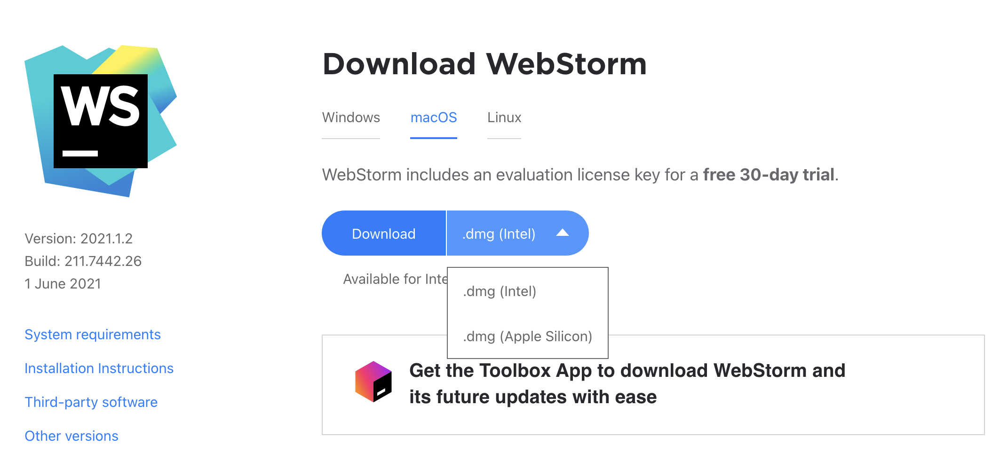
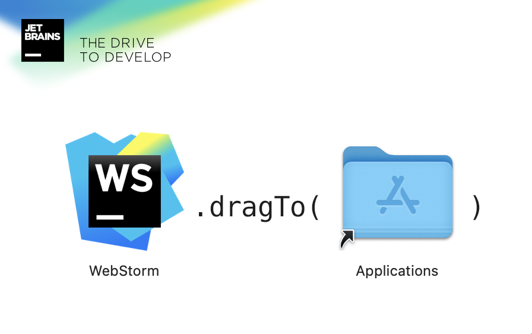
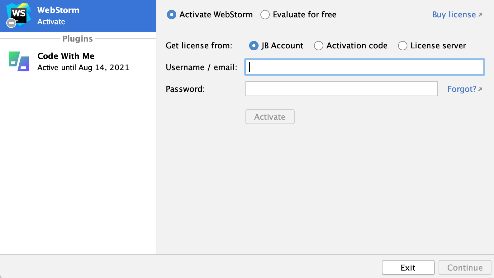

## Vejledning til opsætning af webstorm ( kodeeditor til mac )
Da vi har mest erfaring med Visual Studio Code eller Webstorm, anbefaler vi at i installerer en af disse som jeres editor. 
I må gerne bruge andre editorer som atom, men dem kan vi desværre ikke hjælpe så meget med 

## Opsætning af anbefalet IDE (Kode editor), Webstorm
1. Download IDE på dette link: https://www.jetbrains.com/webstorm/download/#section=mac
   1. Vælg din type af mac - Intel er primært macs ældre end 2020, mens Apple Silicon er macs efter 2020
   
   2. Installer webstorm
    
      
2. Herefter aktiver webstorm --> cmd + space --> søg på webstorm --> tryk på møtrik i nede i venstre hjørne
  og log ind med din jetbrain konto
  
