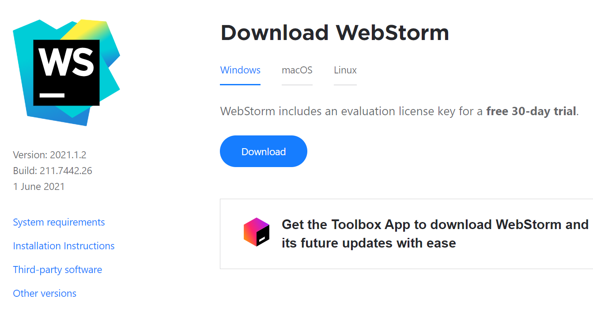
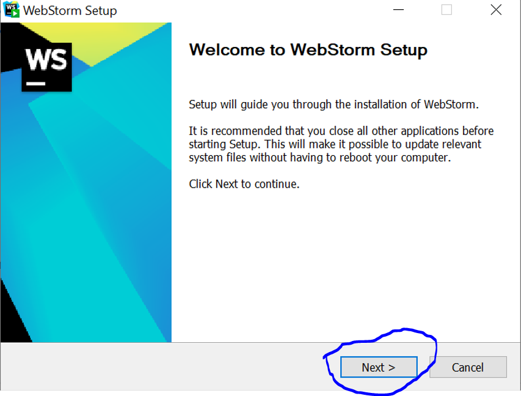
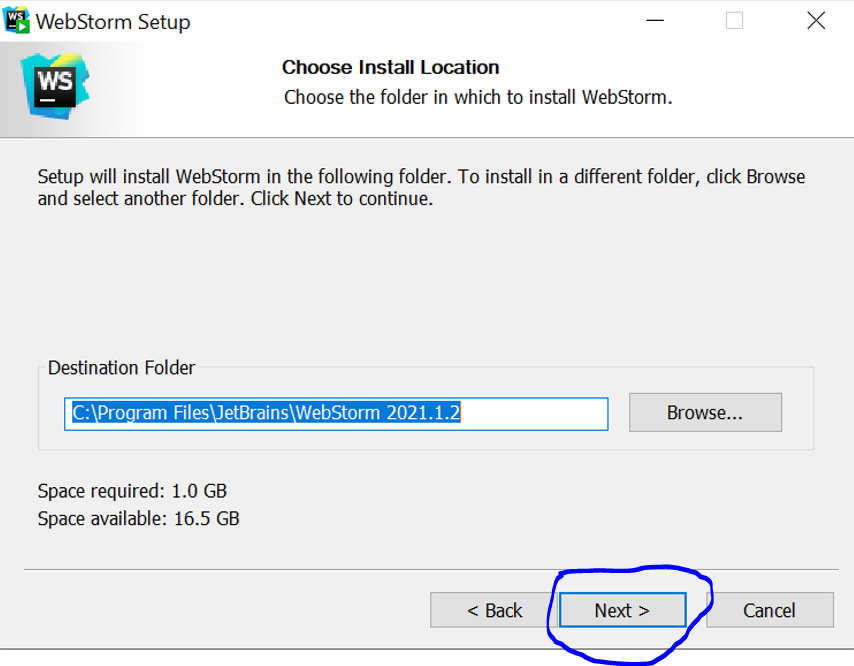
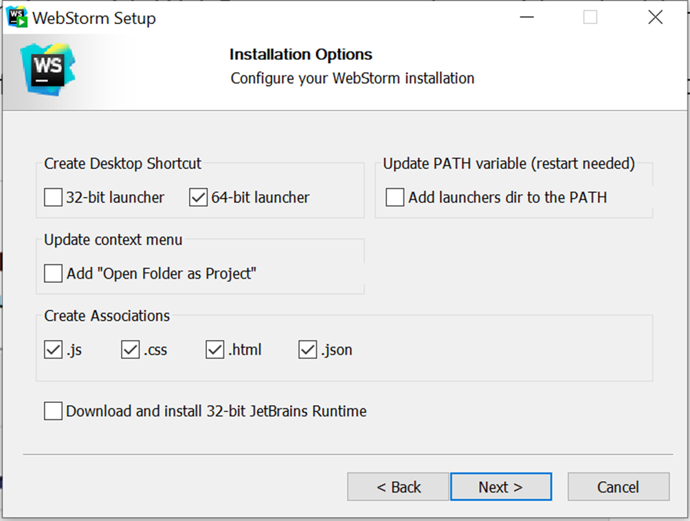
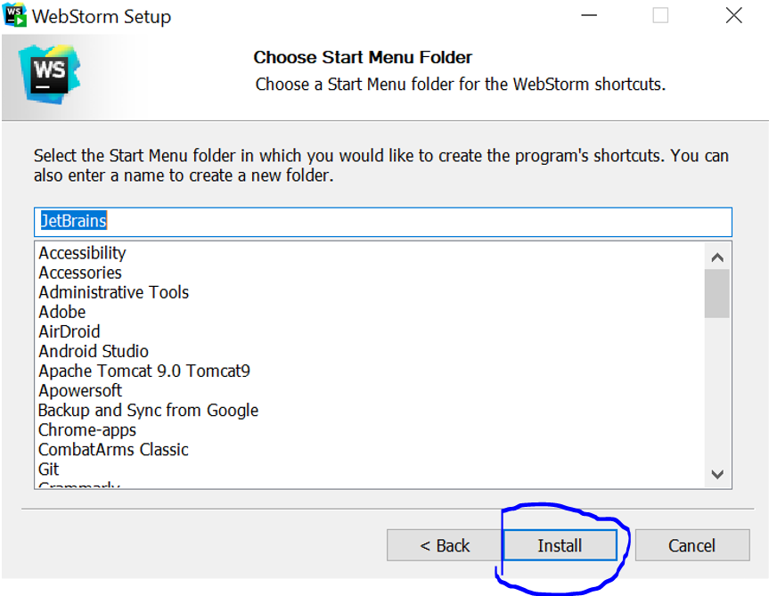
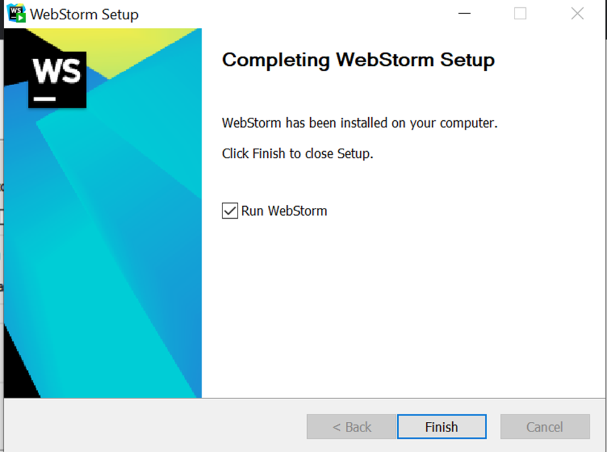

## Vejledning til opsætning af Webstorm på windows

Det anbefales af I benytter Visual Studio Code eller Webstorm som jeres editor. I må gerne bruge andre editorer, såsom atom, men de anbefalet IDE er editorne, som instructorne har mest erfaring med. 

0. Har du ikke brugt Webstorm før, skal du lave en ny Webstorm-konto på: https://account.jetbrains.com - du skal også aktivere en student-license 

1. Download Webstorm ved at trykke på linket herunder: https://www.jetbrains.com/webstorm/download/#section=windows
   

2. I de første to trin trykker man på "next".
   
   
  
   

3. I dette trin sættes der et flueben ud for samme punkter, som vist på billedet herunder:
   
   
   
4. Tryk dernæst på "install"
   
   
   
5. Afslut ved at trykke på "finish"
   
   

6. Webstorm er hermed installeret korrekt og du bør kunne åbne programmet. 

<a href="https://github.com/Innovationg-og-ny-teknologi-2021/0_intro_vejledning/blob/main/windows/2_expo_vejledning.md
" target="_blank">GÅ TIL EXPO VEJLEDNING</a>
   
   
   

