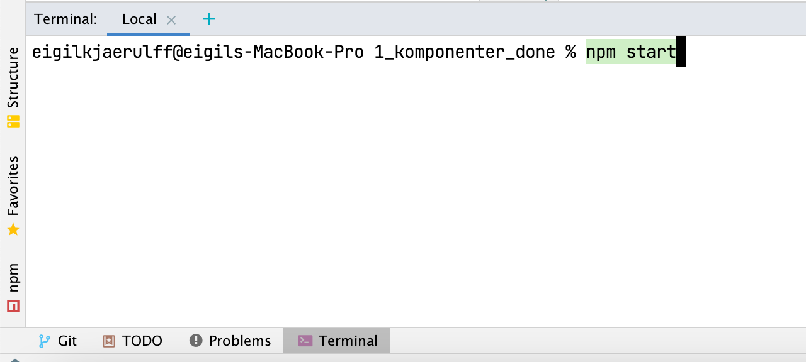
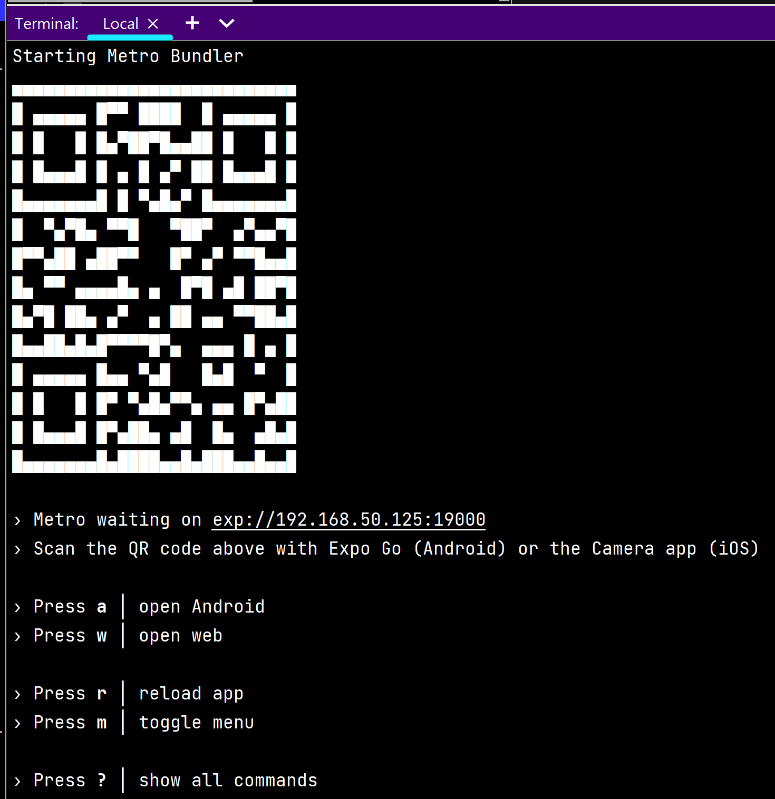

# Opsætning af expo Windows - React native Mobil apps

#### En forudsætning for at kunne installere expo er at man hentet node
- Hent den anbefalede version(LTS) af Node ved at trykke på følgende link: https://nodejs.org/en/
- Du kan tjekke om du allerede har node ved at skrive `node -v` i terminalen. Hvis terminalen returnerer med en versionsbeskrivelse, som ikke er alt for gammel, er alt i orden og du kan hoppe til næste punkt i denne vejledning. 

#### Anvend den officielle guide til at installere expo CLI. Guiden findes på følgende link: https://docs.expo.io/get-started/installation/
- Du skal installerer den fra din Kommandoprompt (terminal)
- Når installationen er færdig, skal du hente expo appen fra din AppStore.
 
  

#### Nu er du klar til at lave dit første projekt! 
- Følg guiden der findes på følgende link: https://docs.expo.dev/get-started/create-a-project/

#### Kør dit først expo projekt!
1. Navigér ind til den mappe, som projektet skal placeres i via terminalen (`cd` & `cd..`)

2. Skriv nu `npx create-expo-app` og vælg 'blank'
3. Find nu dit projekt i Webstorm, og aktivér projektet ved at skrive
   `expo start` i terminalen
   

4. Dernæst åbnes terminalen med expo interfacet. Check først at din computer og telefon kører på det samme net. Scanning af QR-koden foregår ved brug af expo appen.
#### OBS!!! Hvis cbs-nettet / eduroam ikke virker, kan det være nødvendigt at gå på mobil-hotspot. 
   

5. Resultatet skulle være at du skal se denne tekst `Open up App.js to start working on your app!`
6. Prøv at ændre i webstorm filen app.js og se teksten ændre sig

<a href="https://github.com/Innovationg-og-ny-teknologi-2021/0_intro_vejledning/blob/main/windows/3_github_vejledning.md
" target="_blank">GÅ TIL GITHUB VEJLEDNING</a>
